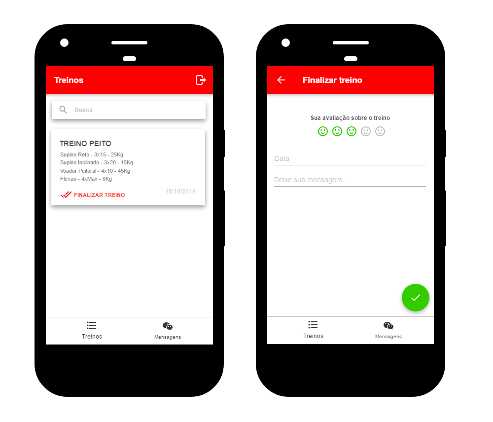
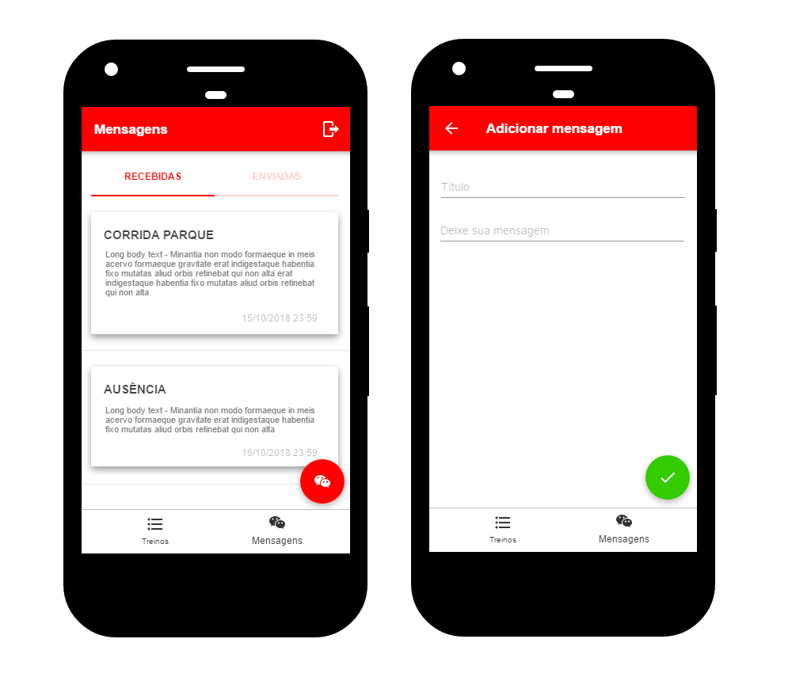

# Protótipos de Interface

Abaixo segue os protótipos de interface criados na fase de iniciação do projeto, desenvolvidos com o objetivo de poder expor e testar a funcionalidade e a usabilidade do sistema.

## Login
Protótipos das telas de login, criação de conta e redefinição de senha.

## Menu de alunos
Protótipos das telas de listagem de alunos e criação de um novo aluno.

## Menu de exercícios
Protótipos das telas de listagem de exercícios e criação de um novo exercício.

## Menu de treinos
Protótipos das telas de listagem de treinos e criação de um novo treino.

## Menu de histórico de treino
Protótipo da tela de histórico de treinos. A tela de histórico de treinos lista todos os treinos que foram finalizados pelos alunos do Personal Trainer, com o feedback dos alunos.

## Menu de mensagens do Personal Trainer
Protótipos da telas de mensagens do Personal Trainer e adição de nova mensagem. Na primeira tela é apresentada a listagem das mensagens enviadas e recebidas. Na segunda tela, é demonstrado o protótipo da tela de adição de nova mensagem.

## Menu de treinos do aluno

## Menu de mensagens do aluno

